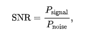
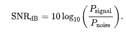
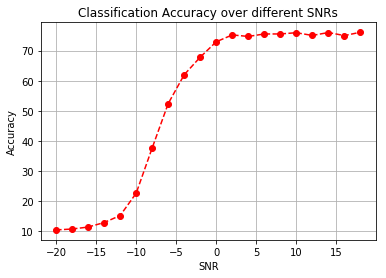
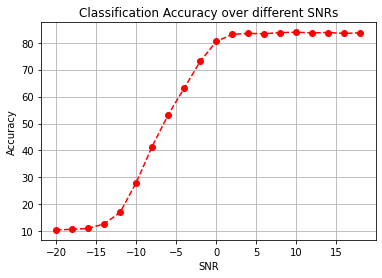

# Signal classification

## Task 
Purpose of project is to classify differnet signal modulations.  

## Dataset 
I use public signal dataset 2016.10A, which is available in https://www.deepsig.ai/datasets. 
Targer classes are: 
'8PSK'
'AM-DSB'
'BPSK'
'CPFSK'
'GFSK'
'PAM4'
'QAM16'
'QAM64'
'QPSK'
'WBFM'
 
Data contains sequance of integers which desicribes our signal. 
Size is about 1.16G  
Input shape is (2, 128)  

Most of reaseach papers over this dataset are doing without any feature engineearing.
## Method  
CNN architecture is from  https://arxiv.org/pdf/1602.04105.pdf

## Evaluation 
Architecture in paper was used without batch normalization trick. In my experiment I also added batch normalization before each activation function. See result in picture. 
**NOTE** Images were ploted over test dataset. 
### SNR 
  
**SNR** is ratio between **Power** of signal and noise in decibels scale  
    

